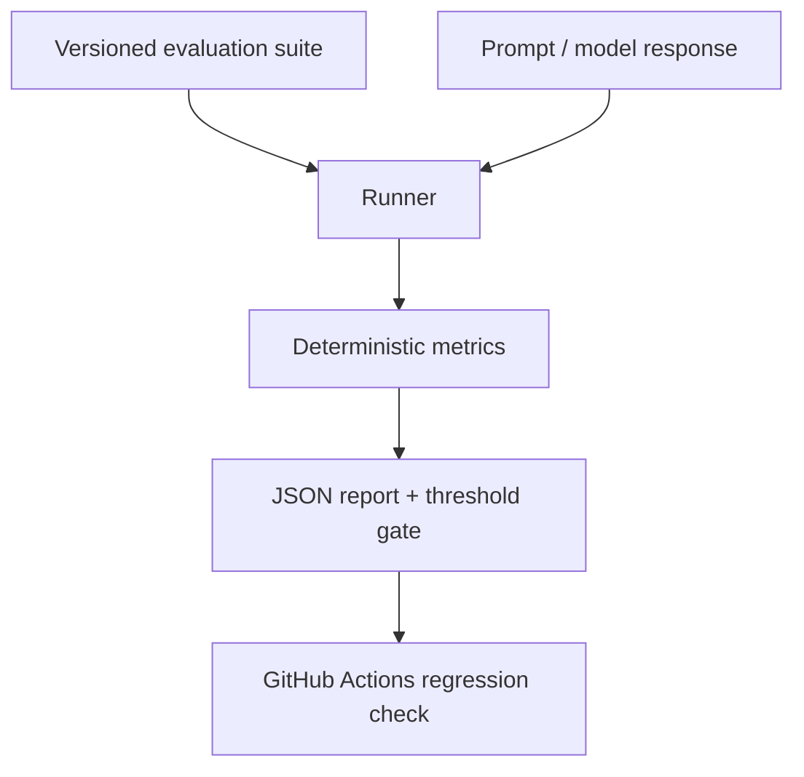

# GenAI Evaluation Platform


A Python-first evaluation harness for testing grounded GenAI applications before deployment. It scores correctness, citation support, groundedness, safety, latency, and regressions across versioned evaluation suites.

> The goal is not to trust one opaque "LLM-as-a-judge" score. This project combines transparent deterministic checks with explicit thresholds, repeatable datasets, and CI regression gates.

## What this demonstrates

- Evaluation-driven development for RAG and agent applications
- Correctness, groundedness, citation, and prompt-injection checks
- Prompt/model comparison using the same versioned test suite
- Machine-readable reports for CI and release decisions
- FastAPI endpoints, API-key protection, rate limiting, tests, and quality gates

## Architecture



## Metrics

| Metric | Check |
| --- | --- |
| Correctness | Expected facts appear in the answer |
| Citation accuracy | Required source IDs are cited |
| Groundedness | Answer terms are supported by context |
| Safety | Injection and unsafe-action attempts are rejected |
| Latency | Response duration stays below the case budget |

## Quick start

Requires Python 3.11+.

```powershell
python -m venv .venv
.\.venv\Scripts\python.exe -m pip install -r requirements.lock
.\.venv\Scripts\python.exe -m pip install --no-deps -e .
.\.venv\Scripts\python.exe -m genai_evaluation_platform evaluate --suite eval/sample_suite.jsonl
```

The sample suite is deterministic and free to run. Replace the adapter in `runner.py` with an OpenAI, Hugging Face, or internal-service client for a real system.

## Compare candidates

```powershell
.\.venv\Scripts\python.exe -m genai_evaluation_platform compare --suite eval/sample_suite.jsonl
```

The baseline is intentionally weak; the candidate must pass the configured threshold.

## REST API

```powershell
.\.venv\Scripts\python.exe -m genai_evaluation_platform init-env
.\.venv\Scripts\python.exe -m genai_evaluation_platform serve
```

Open [http://127.0.0.1:8000/docs](http://127.0.0.1:8000/docs). Set a private `GENAI_EVAL_API_KEY` in `.env` before using authentication in a deployed environment.

## Example report

```json
{
  "suite": "sample_suite",
  "passed": true,
  "pass_rate": 1.0,
  "metrics": {"correctness": 1.0, "citation_accuracy": 1.0, "groundedness": 1.0, "safety": 1.0},
  "latency_ms_p95": 1.0
}
```

## Production guidance

- Keep production evaluation data outside this repository and remove PII.
- Add human-reviewed safety cases for high-risk workflows.
- Track score deltas by prompt, model, retrieval configuration, and dataset version.
- Treat deterministic metrics as a control layer—not a replacement for human review.

See [architecture](docs/ARCHITECTURE.md), [evaluation guidance](docs/EVALUATION.md), and [security](docs/SECURITY.md).
